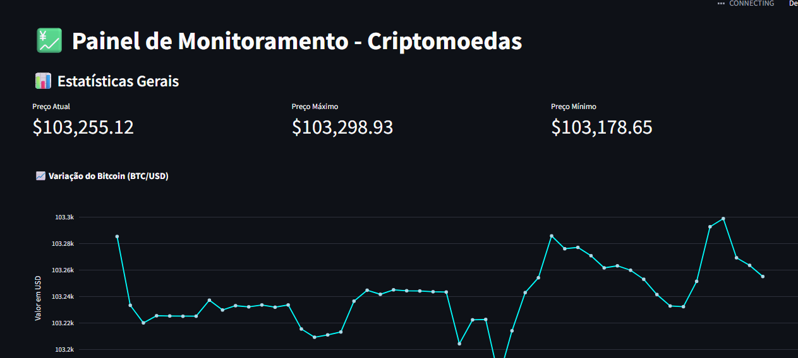

# 🚀 Pipeline de Dados com API & IA para Criptoativos

🔗 **[ 👉 Acesse o Dashboard no streamlit Aqui ](https://pipeline-cripto-ia.streamlit.app)**  
📸 

Este projeto implementa um pipeline inteligente para **coleta, processamento, análise e visualização** de dados do mercado de **criptomoedas**, integrando **Inteligência Artificial** e **dashboards interativos** em tempo real.

---

## ⚙️ Funcionalidades

- 📥 **Coleta de Dados via API**  
  Integra com API **coinbase** para ingestão automática e periódica dos dados de mercado.

- 🧹 **Pipeline de Processamento**  
  Limpeza, transformação e enriquecimento dos dados, prontos para análises preditivas e visuais.
  **Utilizei o banco de dados postgres para salvar os dados.**

- 📊 **Dashboards Interativos**  
  Visualize indicadores, tendências e métricas cripto em interfaces dinâmicas com **Streamlit**.

- 🤖 **Análises com Inteligência Artificial**  
  Aplicação de modelos de **machine learning do Groq* para:
  - Previsão de preços
  - Detecção de padrões
  - Geração de insights automáticos
---

## 🧰 Tecnologias Utilizadas

- 🐍 Python (3.10+)
- 📦 Pandas, NumPy
- 🔗 APIs de Criptomoedas (Coinbase)
- 📈 Dash, Streamlit, plotly (visualização)
- 🤖 Agno, Groq (IA)


---

## 🗂️ Estrutura do Projeto

```
📦 seu_projeto/
├── 📁 agents/              # Scripts automatizados (agendadores, bots)
│   └── alerta_agente.py
├── 📁 app/                 # Código da interface e visualização
│   └── dashboard.py
├── 📁 pipeline/            # Ingestão, tratamento e conexão com DB/API
│   └── dados_postgres.py
├── 📁 img/                 # Imagens para README e frontend
│   └── dashboard_preview.png
├── 📁 venv/                # Ambiente virtual (não versionado)
├── 📄 .env                 # Variáveis de ambiente
├── 📄 .gitignore
├── 📄 README.md
└── 📄 requirements.txt     # Dependências do projeto
```

## ▶️ Como Rodar o Projeto

```bash
# Clone o repositório
git clone https://github.com/seu_usuario/seu_projeto.git
cd seu_projeto

# Ative o ambiente virtual
python -m venv venv
source venv/bin/activate     # ou venv\Scripts\activate no Windows

# Instale as dependências
pip install -r requirements.txt

# Configure as variaveis de ambiente
- DB_URL (criar o banco em: https://dashboard.render.com/)
- GROQ_API_KEY

# Rode os dados
streamlit run app/dashboard.py

# Rode o dashboard
python pipeline/dados_postgres.py

```

## 🤝 Contribuições
Fique à vontade para abrir issues, sugerir melhorias ou enviar um pull request 🚀

## 📬 Contato

- 💼 https://www.linkedin.com/in/edinei-andrade/
- [](https://wa.me/77999272367?text=Olá!%20Gostaria%20de%20saber%20mais%20sobre%20automação.%0AVim%20do%20github.)
